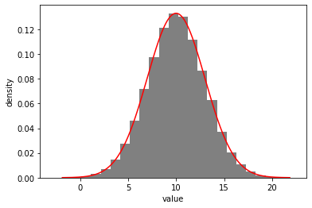
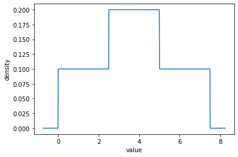
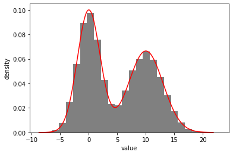
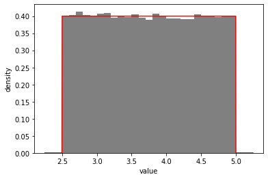
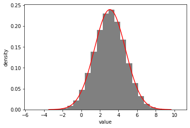
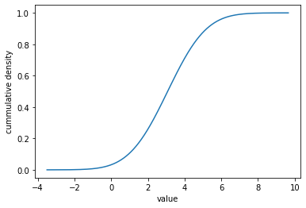
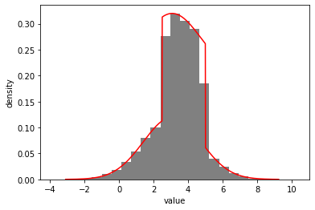

```python
import distl
import numpy as np
```

# And/Or logic


```python
u1 = distl.uniform(0, 5)
```


```python
print(u1)
```

    <distl.uniform low=0.0 high=5.0>


```python
out = u1.plot(show=True)
```


```python
u2 = distl.uniform(2.5, 7.5)
```


```python
print(u2)
```

    <distl.uniform low=2.5 high=7.5>


```python
out = u2.plot(show=True)
```


```python
g1 = distl.gaussian(0, 2)
```


```python
out = g1.plot(show=True)
```


```python
g2 = distl.gaussian(10,3)
```


```python
out = g2.plot(show=True)
```





Note that trying to apply an 'and' operator where either of the distributions is a [multivariate slice](./multivariate_slice.md) will fail with an error as covariances cannot be guaranteed to be preserved.  Instead you'll have to convert to a univariate manually first with [MultivariateSlice.to_univariate](../api/BaseMultivariateSlice.to_univariate.md).

## OR


```python
u1_or_u2 = u1 | u2
```


```python
print(u1_or_u2)
```

    <distl.uniform low=0.0 high=5.0>|<distl.uniform low=2.5 high=7.5>


```python
u1_or_u2.pdf(0.5)
```


    0.09999400035997841


```python
u1_or_u2.cdf(0.5)
```


    0.049999999999999996


```python
u1_or_u2.cdf(29)
```


    1.0


```python
out = u1_or_u2.plot_pdf(show=True)
```





```python
out = u1_or_u2.plot_cdf(show=True)
```


```python
u1_or_u2.sample(size=10)
```


    array([3.45101347, 1.99161164, 1.23957025, 1.0690838 , 3.62931654,
           4.44894492, 5.08941398, 7.45128414, 5.55152966, 6.96525364])


```python
out = u1_or_u2.plot(show=True)
```


```python
u1_or_u2.to_histogram().pdf(3.5)
```


    0.2023023452604038


```python
u1_or_u2.pdf(3.5)
```


    0.19998800071995682


```python
out = (g1 | g2).plot(show=True)
```





```python
out = ((g1 | g2) | (u1 | u2)).plot(show=True)
```


## AND


```python
u1_and_u2 = u1 & u2
```


```python
out = u1_and_u2.plot(show=True)
```





```python
u1_and_u2.pdf(3.5)
```


    0.39996800255979525


```python
g1_and_g2 = g1 & g2
```


```python
out = g1_and_g2.plot(show=True)
```





```python
out = g1_and_g2.plot_cdf(show=True)
```





```python
out = ((u1 & u2) | (g1 & g2)).plot(show=True)
```





```python

```
