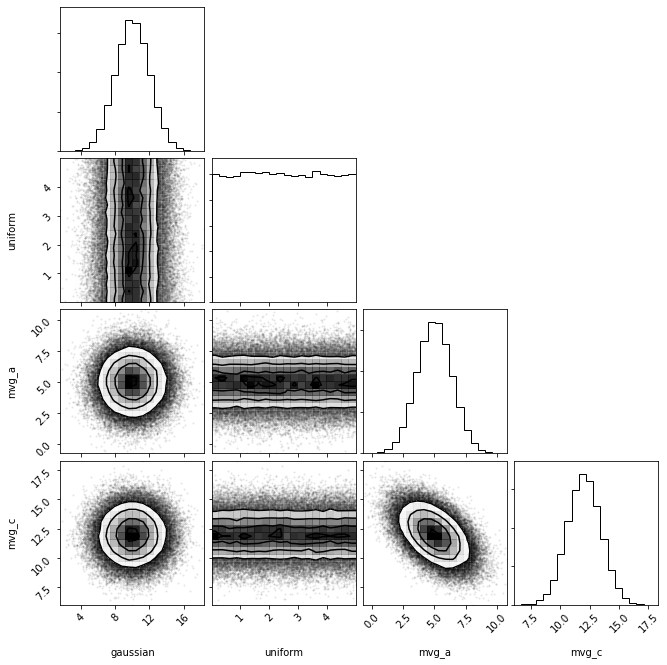

```python
import distl
import numpy as np
```

[DistributionCollections](../api/DistributionCollection.md) allow for sampling (and computing probabilities) on multiple distributions simultaneously, respecting any covariances between the distributions within that set.

# "Simple Case" (Univariate only)

Let's first look at the simplest case possible with two univariate distributions.  As these will be drawn independently, there is little gained by using a [DistributionCollection](../api/DistributionCollection.md) over simply handling the two objects separately, but this example shows the syntax without having to deal with complex subtle points.


```python
g = distl.gaussian(10, 2, label='gaussian')
u = distl.uniform(0, 5, label='uniform')
```


```python
dc = distl.DistributionCollection(g, u)
```


```python
dc
```


    <distl.distl.DistributionCollection at 0x7fede06a3910>


When calling [sample](../api/DistributionCollection.sample.md), values are returned for each distribution in the order they were passed when initializing the object.


```python
dc.sample()
```


    array([7.94423774, 4.72145878])


If ever unsure, we can access the underlying distribution objects via the [distributions](../api/DistributionCollection.distributions.md) or [labels](../api/DistributionCollection.labels.md) properties.


```python
dc.distributions
```


    [<distl.gaussian loc=10.0 scale=2.0 label=gaussian>,
     <distl.uniform low=0.0 high=5.0 label=uniform>]


```python
dc.labels
```


    ['gaussian', 'uniform']


If passing `size` to [sample](../api/DistributionCollection.sample.md), we get a matrix with shape (`size`, `len(distributions)`)


```python
dc.sample(size=3)
```


    array([[ 7.82518743,  1.82379003],
           [10.23970772,  1.19782394],
           [10.14979313,  0.74741029]])


We can also call [plot](../api/DistributionCollection.plot.md) or [plot_sample](../api/DistributionCollection.plot_sample.md).  Here we're shown a corner plot and see that the samples were drawn independently (without any covariances).


```python
out = dc.plot(show=True)
```


Additionally, we can access [pdf](../api/DistributionCollection.pdf.md), [logpdf](../api/DistributionCollection.logpdf.md), [cdf](../api/DistributionCollection.cdf.md), and [logcdf](../api/DistributionCollection.logcdf.md). These all take a single argument which must be a list/tuple/array with the same length as the number of distributions.

In the case of univariate distributions, pdf and cdf will be simply the product of the values from the children distributions, and logpdf and logcdf the sums.  However, this is where subtle complications come into place with [Composite](../api/Composite.md) and Multivariate distributions, which we'll see in the next few sections.


```python
dc.pdf([10, 5])
```


    0.039894228040143274


```python
g.pdf(10) * u.pdf(5)
```


    0.039894228040143274


# MultivariateSlice distributions

Note that each distribution passed to a collection must be a univariate or multivariate-slice.  If attempting to pass a multivariate object without slicing to a single dimension, an error will be raised.

First we'll create a [gaussian](../api/distl.gaussian.md), [uniform](../api/distl.uniform.md), and [multivariate gaussian](../api/distl.mvgaussian.md) distributions.


```python
g = distl.gaussian(10, 2, label='gaussian')
u = distl.uniform(0, 5, label='uniform')
mvg = distl.mvgaussian([5,10, 12], 
                       np.array([[ 2,  1, -1], 
                                 [ 1,  2,  1], 
                                 [-1,  1,  2]]),
                       allow_singular=True,
                       labels=['mvg_a', 'mvg_b', 'mvg_c'])
```

Now let's imagine a scenario where we want to draw from the following sub-distributions: 'gaussian', 'uniform', 'mvg_a', and 'mvg_c' (but let's say we don't want 'mvg_b').  Here we want to *maintain* the covariances between 'mvg_a' and 'mvg_c' while *independently* sampling from 'gaussian' and 'uniform'.

Yes, in theory you could call sample on `g`, `u`, `mvg` and just ignore the second index in the returned arrays from `mvg.sample`... but a [DistributionCollection](../api/DistributionCollection.md) starts to provide some convenience in this case for both plotting and accessing the probabilities of a given drawn sample.  This becomes especially useful when coupled with [sample caching](./sample_cache.md).

To learn more about slicing multivariate distributions, see [multivariate slicing](./multivariate_slice.md), but in simple terms it allows you to select a single dimension from a multivariate distribution, acting like a univariate distribution but still retaining the underlying covariances of the multivariate distribution.


```python
dc = distl.DistributionCollection(g, u, mvg.slice('mvg_a'), mvg.slice('mvg_c'))
```


```python
dc.sample()
```


    array([ 9.67013996,  4.90442455,  5.19534466, 13.80264406])


```python
out = dc.plot(show=True)
```





As in the univariate case, [pdf](../api/DistributionCollection.pdf.md) takes a tuple/list/array.  This time, the pdf will account for the covariance between 'mvg_a' and 'mvg_c', by default.  As 'mvg_b' is not included, no value will be assumed, but rather will be marginalized over (via [take_dimensions](../api/BaseMultivariateDistribution.take_dimensions.md), see [multivariate examples](./multivariate.md) for more details).


```python
dc.labels
```


    ['gaussian', 'uniform', 'mvg_a', 'mvg_c']


```python
dc.pdf([10, 5, 5, 11])
```


    0.0026266653362734885


which could be computed manually as:


```python
g.pdf(10) * u.pdf(5) * mvg.take_dimensions(['mvg_a', 'mvg_c']).pdf([5, 11])
```


    0.0026266653362734885


To avoid this behavior and instead sum/multiply over the flattened univariate versions of each of the sampled parameters, pass `as_univariates=True` to [pdf](../api/DistributionCollection.pdf.md).


```python
dc.pdf([10, 5, 5, 11], as_univariates=True)
```


    0.0024724446692818785


which could be computed manually as:


```python
g.pdf(10) * u.pdf(5) * mvg.to_univariate('mvg_a').pdf(5) * mvg.to_univariate('mvg_c').pdf(11)
```


    0.0024724446692818785


# Composite (math operators) distributions

Now let's consider a more complex example: let's sample from 'gaussian * mvg_a' and 'mvg_c'.  Here we want the covariance between 'mvg_a' and 'mvg_c' respected, even though there is a math operation on the result of 'mvg_a'.


```python
# TODO: this won't work until math with multivariates is implemented
#dc = distl.DistributionCollection(g * mvg.slice('mvg_a'), mvg.slice('mvg_c'))
```


```python
#dc.sample()
```


```python
#out = dc.plot(show=True)
```

As in the univariate case, [pdf](../api/DistributionCollection.pdf.md) takes a tuple/list/array.  However, in order to respect the covariances, the length of the input must match that of the underlying distributions that were sampled (see [labels_unpacked](../api/DistributionCollection.labels_unpacked.md) or [distributions_unpacked](../api/DistributionCollection.distributions_unpacked.md)).


```python
#dc.labels_unpacked
```


```python
#dc.pdf([5, 10, 10])
```

As with the multivariate case above, we can pass `as_univariates=True` to instead calculate the pdf from the flattened univariate representations of each of the sampled parameters.  In this case, the passed samples much match the length of the exposed sampled parameters (see [labels](../api/DistributionCollection.labels.md) or [distributions](../api/DistributionCollection.distributions.md)).


```python
#dc.labels
```


```python
#dc.pdf([5, 10])
```


```python

```
