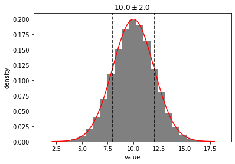
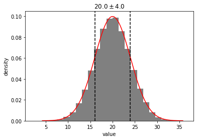
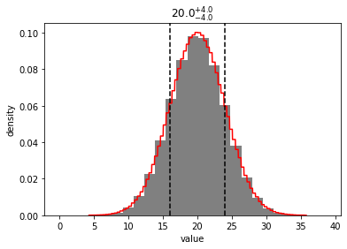
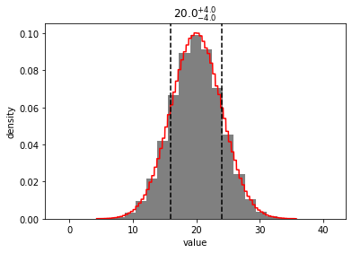
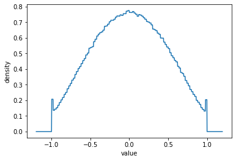
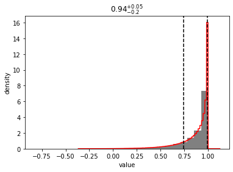
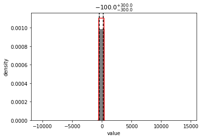

```python
import distl
import numpy as np
```

# Math with Integers/Floats


```python
g = distl.gaussian(10, 2)
```


```python
out = g.plot(show=True)
```





multiplying a [Gaussian distribution](../api/Gaussian.md) by a float or integer treats that float or integer as a [Delta distribution](../api/Delta.md).  In this case, it is able to return another [Gaussian distribution](../api/Gaussian.md).  When unable to return a supported distribution type, a [Composite distribution](../api/Composite.md) will be returned instead.


```python
print(2*g)
```

    <distl.gaussian loc=20.0 scale=4.0>


```python
print(g*2)
```

    <distl.gaussian loc=20.0 scale=4.0>


```python
out = (g*2).plot(show=True)
```





Note that this gives us the same resulting distribution as if we defined a [Delta distribution](../api/Delta.md) manually and multiplied by that.


```python
d = distl.delta(2)
```


```python
print(g*d)
```

    <distl.gaussian loc=20.0 scale=4.0>


```python
out = (g*d).plot(show=True)
```


If we multiply in the other order, we'll get a [Composite distribution](../api/Composite.md), but see that it gives us the same resulting sample.


```python
print(d*g)
```

    <distl.delta loc=2.0> * <distl.gaussian loc=10.0 scale=2.0>


```python
out = (d*g).plot(show=True)
```





Note that since the floats/integers are treated as distributions, `2*g` is **not** equivalent to `g+g` (note the change in the x-limit scale on the plot below compared to those above).


```python
print(g+g)
```

    <distl.gaussian loc=10.0 scale=2.0> + <distl.gaussian loc=10.0 scale=2.0>


```python
out = (g+g).plot(show=True)
```





# Supported Operators

* multiplication
* division
* addition
* subtraction
* np.sin, np.cos, np.tan

(for and/or logic, see [these examples](and_or.md))


```python
g = distl.gaussian(2*np.pi, np.pi/6)
```


```python
print(np.sin(g))
```

    sin(<distl.gaussian loc=6.283185307179586 scale=0.5235987755982988>)


```python
out = g.plot_pdf(show=True)
```


```python
out = np.sin(g).plot_pdf(show=True)
```





```python
out = np.sin(g).plot_cdf(show=True)
```


```python
out = np.sin(g).plot(show=True)
```


```python
out = np.cos(g).plot(show=True)
```





```python
out = np.tan(g).plot(show=True)
```





```python

```
