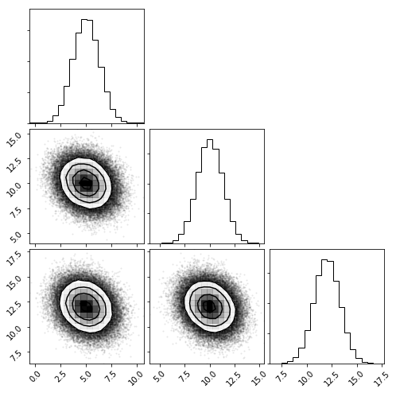
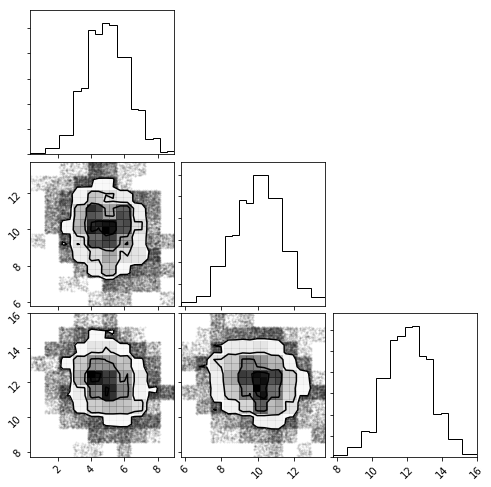
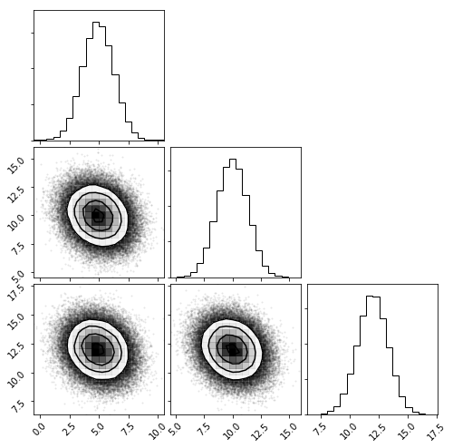

```python
import npdists
import numpy as np
```


```python
mvg = npdists.mvgaussian([5,10, 12], np.array([[ 1., 1., -1.], [1, -1, 1], [-1., 1.,  1.]]))
```


```python
mvg.means
```


    [5, 10, 12]


```python
mvg.covariances
```


    array([[ 1.,  1., -1.],
           [ 1., -1.,  1.],
           [-1.,  1.,  1.]])


```python
mvg.plot(show=True)
```

    /home/kyle/.local/lib/python2.7/site-packages/npdists-0.1.0.dev0-py2.7.egg/npdists/npdists.py:952: RuntimeWarning: covariance is not positive-semidefinite.





```python
mvh = mvg.to_mvhistogram()
```


```python
mvh.plot(show=True)
```





```python
mvh.ndimensions
```


    3


```python
mvh.means
```


    [4.925224407767696, 9.917332103497039, 12.012708452098943]


```python
mvh.covariances
```


    array([[ 1.70746864, -0.3386417 , -0.32937709],
           [-0.3386417 ,  1.82331543, -0.33388958],
           [-0.32937709, -0.33388958,  1.73651273]])


```python
mvhg = mvh.to_mvgaussian()
```


```python
mvhg.plot(show=True)
```





```python
mvhg.means
```


    [4.939194686320406, 9.971444324306338, 11.968570240345853]


```python
mvhg.covariances
```


    array([[ 1.70305748, -0.33501587, -0.31426569],
           [-0.33501587,  1.83181591, -0.34252835],
           [-0.31426569, -0.34252835,  1.74348311]])


```python

```
