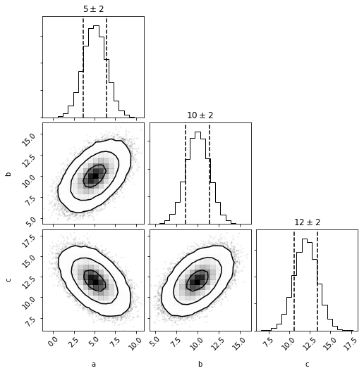

```python
import distl
import numpy as np
```

# Multivariate Gaussian

First we'll create a [multivariate gaussian](../api/MVGaussian.md) distribution by providing the means and covariances of three parameters.


```python
mvg = distl.mvgaussian([5,10, 12], 
                       np.array([[ 2,  1, -1], 
                                 [ 1,  2,  1], 
                                 [-1,  1,  2]]),
                       allow_singular=True,
                       labels=['a', 'b', 'c'])
```


```python
mvg.sample()
```


    array([ 1.6349023 ,  9.31542872, 14.68052642])


```python
mvg.sample(size=5)
```


    array([[ 3.38803154, 10.20269485, 13.81466331],
           [ 5.63749786,  8.81408128, 10.17658342],
           [ 5.21785047,  9.05944187, 10.84159139],
           [ 5.50934421,  9.63974854, 11.13040432],
           [ 6.30714681, 10.4926462 , 11.18549938]])


and plotting will now show a corner plot (if [corner](https://corner.readthedocs.io/en/latest/) is installed)


```python
fig = mvg.plot(show=True)
```





# Multivariate Histogram

we can now convert this multivariate gaussian distribution into a [multivariate histogram](../api/MVHistogram.md) distribution (alternatively we could create a histogram directly from a set of samples or chains via [mvhistogram_from_data](../api/distl.mvhistogram_from_data.md).


```python
mvh = mvg.to_mvhistogram(bins=15)
```


```python
fig = mvh.plot(show=True, size=1e6)
```


```python
np.asarray(mvh.density.shape)
```


    array([15, 15, 15])


Now if we access the means and covariances, we'll see that they are slightly different due to the binning.


```python
mvh.calculate_means()
```


    array([ 4.97433536,  9.97184364, 11.03656561])


```python
mvh.calculate_covariances()
```


    array([[ 2.13563697,  1.00448591, -0.99835494],
           [ 1.00448591,  2.11557059,  0.98538345],
           [-0.99835494,  0.98538345,  2.12998975]])


If we convert back to a multivariate gaussian, these are the means and covariances that will be adopted (technically not exactly as they'll be recomputed from another sampling of the underlying distribution).


```python
mvhg = mvh.to_mvgaussian()
```


```python
fig = mvhg.plot(show=True)
```


```python
mvhg.mean
```


    array([ 4.96969371,  9.97363158, 11.04018043])


```python
mvhg.cov
```


    array([[ 2.125729  ,  1.00460443, -0.99311524],
           [ 1.00460443,  2.1272161 ,  0.99650916],
           [-0.99311524,  0.99650916,  2.13774372]])


# Take Dimensions


```python
mvg_ac = mvg.take_dimensions(['a', 'c'])
```


```python
mvg_ac.sample()
```


    array([ 3.72463587, 11.06296155])


```python
out = mvg_ac.plot(show=True)
```


```python
out = mvh.take_dimensions(['a', 'c']).plot(show=True)
```


## Passing a single dimension to take_dimension

If you pass a single-dimension to take_dimension, then the univariate version of the same type is returned instead.  See the "Converting to Univariate" section below for examples directly calling [to_univariate](../api/BaseMultivariateDistribution.to_univariate.md).


```python
out = mvg.take_dimensions(['a']).plot(show=True)
```


# Slicing

Slicing allows taking a single dimension while retaining all underlying covariances such that the resulting distribution can undergo [math operations](./math.md), [and/or logic](./and_or.md), and included in [distribution collections](./collections.md).  For more details, see the [slice examples](./slice.md).


```python
mvg_a = mvg.slice('a')
```


```python
mvg_a.sample()
```


    5.846409763114287


```python
out = mvg_a.plot(show=True)
```


```python
mvg_a.multivariate
```


    <distl.mvgaussian mean=[5, 10, 12] cov=[[ 2  1 -1]
     [ 1  2  1]
     [-1  1  2]] allow_singular=True labels=['a', 'b', 'c']>


# Converting to Univariate

There are methods to convert directly to the univariate distribution of the same type as the univariate:

* [Multivariate.to_univariate](../api/BaseMultivariateDistribution.to_univariate.md).
* [MultivariateSlice.to_univariate](../api/BaseMultivariateSliceDistribution.to_univariate.md).

When acting on a Multivariate, the requested dimension must be passed.


```python
mvg.to_univariate(dimension='a')
```


    <distl.gaussian loc=5.0 scale=1.4142135623730951 label=a>


Whereas a MultivariateSlice converts using the sliced dimension


```python
mvg_a.to_univariate()
```


    <distl.gaussian loc=5.0 scale=1.4142135623730951 label=a>


