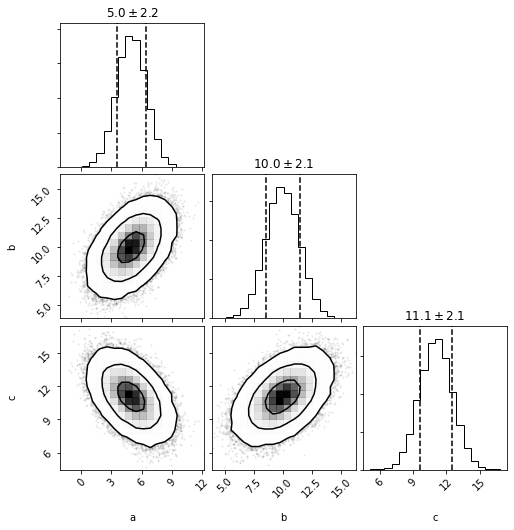

```python
import distl
import numpy as np
```

First we'll create a [multivariate gaussian](../api/MVGaussian.md) distribution by providing the means and covariances of three parameters.


```python
mvg = distl.mvgaussian([5,10, 12], 
                       np.array([[ 2,  1, -1], 
                                 [ 1,  2,  1], 
                                 [-1,  1,  2]]),
                       allow_singular=True,
                       labels=['a', 'b', 'c'])
```


```python
mvg.sample()
```


    array([ 5.28918573, 11.21208674, 12.92290101])


```python
mvg.sample(size=5)
```


    array([[ 5.69256978, 12.65094467, 13.95837489],
           [ 5.48324556,  8.00583062,  9.52258506],
           [ 4.04494092,  7.86700014, 10.82205921],
           [ 2.41793021,  8.99122719, 13.57329698],
           [ 2.67232714, 10.60534095, 14.9330138 ]])


and plotting will now show a corner plot (if [corner](https://corner.readthedocs.io/en/latest/) is installed)


```python
fig = mvg.plot(show=True)
```


we can now convert this multivariate gaussian distribution into a [multivariate histogram](../api/MVHistogram.md) distribution


```python
mvh = mvg.to_mvhistogram(bins=15)
```


```python
fig = mvh.plot(show=True, size=1e6)
```


```python
np.asarray(mvh.density.shape)
```


    array([15, 15, 15])


Now if we access the means and covariances, we'll see that they are slightly different due to the binning.


```python
mvh.calculate_means()
```


    array([ 4.97142828,  9.97154187, 11.05755981])


```python
mvh.calculate_covariances()
```


    array([[ 2.12439248,  0.99252033, -0.99530192],
           [ 0.99252033,  2.12913431,  1.00080292],
           [-0.99530192,  1.00080292,  2.1276206 ]])


If we convert back to a multivariate gaussian, these are the means and covariances that will be adopted (technically not exactly as they'll be recomputed from another sampling of the underlying distribution).


```python
mvhg = mvh.to_mvgaussian()
```


```python
fig = mvhg.plot(show=True)
```





```python
mvhg.mean
```


    array([ 4.96348824,  9.96372407, 11.06157606])


```python
mvhg.cov
```


    array([[ 2.14968705,  1.0014201 , -1.01230489],
           [ 1.0014201 ,  2.11435132,  0.98121077],
           [-1.01230489,  0.98121077,  2.12815416]])


```python

```
