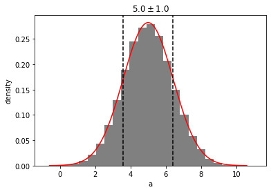
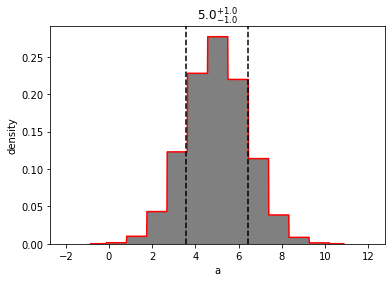

```python
import distl
import numpy as np
```

# Multivariate Gaussian

First we'll create a [multivariate gaussian](../api/MVGaussian.md) distribution by providing the means and covariances of three parameters.


```python
mvg = distl.mvgaussian([5,10, 12], 
                       np.array([[ 2,  1, -1], 
                                 [ 1,  2,  1], 
                                 [-1,  1,  2]]),
                       allow_singular=True,
                       labels=['a', 'b', 'c'])
```


```python
fig = mvg.plot(show=True)
```


```python
mvg_a = mvg.slice('a')
```


```python
mvg_a
```


    <distl.mvgaussianslice dimension=0 mean=[5, 10, 12] cov=[[ 2  1 -1]
     [ 1  2  1]
     [-1  1  2]] allow_singular=True label=a)>


```python
mvg_a.multivariate
```


    <distl.mvgaussian mean=[5, 10, 12] cov=[[ 2  1 -1]
     [ 1  2  1]
     [-1  1  2]] allow_singular=True labels=['a', 'b', 'c']>


```python
mvg_a.dimension
```


    0


```python
mvg_a.label
```


    'a'


The sliced object acts more or less as the univariate version of the multivariate distribution.


```python
mvg_a.loc
```


    5


```python
mvg_a.scale
```


    1.4142135623730951


Sampling draws from the underlying multivariate distribution but only returns the value for the requested dimension.  This means that covariances can be maintained (when using [DistributionCollection](collections.md) or carefully managing the random seeds manually).


```python
mvg_a.sample()
```


    5.708155660638659


```python
out = mvg_a.plot(show=True)
```


The exposed univariate methods (pdf, cdf, etc) are based on the univariate version (with the exception of ppf, which is disabled).  If you want the probability of drawing a value of 'a', given some values of 'b' and 'c' (for example), then must pass those three values to the underlying multivariate distribution.

**NOTE**: currently there is no ability to plot_pdf of a with fixed values of b and c.... maybe that would be a better use of "slice" and use "flatten" for this current behavior?


```python
out = mvg_a.plot_pdf(show=True)
```


```python
out = mvg_a.multivariate.plot(show=True)
```


```python
g_a = mvg_a.to_univariate()
# same as mvg.to_univariate(dimension='a')
```


```python
g_a
```


    <distl.gaussian loc=5.0 scale=1.4142135623730951 label=a>


```python
out = g_a.plot(show=True)
```





```python
mvh = mvg.to_mvhistogram()
```

# Multivariate Histogram


```python
out = mvh.plot(show=True)
```


```python
mvh_a = mvh.slice('a')
```


```python
mvh_a.sample()
```


    array([5.52686366])


```python
mvh_a.sample(size=3)
```


    array([4.07182635, 4.31433257, 3.40493425])


```python
mvh_a.bins
```


    array([-1.68769634, -0.77829802,  0.1311003 ,  1.04049862,  1.94989694,
            2.85929526,  3.76869358,  4.6780919 ,  5.58749021,  6.49688853,
            7.40628685,  8.31568517,  9.22508349, 10.13448181, 11.04388013,
           11.95327845])


```python
mvh_a.density
```


    array([1.56192984e-05, 3.34513307e-04, 2.99760368e-03, 1.66098222e-02,
           6.49085975e-02, 1.64611785e-01, 2.82894129e-01, 3.27636910e-01,
           2.53084698e-01, 1.30775179e-01, 4.53363151e-02, 1.05313119e-02,
           1.67907457e-03, 1.73113890e-04, 1.95241229e-05])


```python
out = mvh_a.plot(show=True, bins=10)
```


```python
out = mvh_a.to_univariate().plot(show=True)
```




