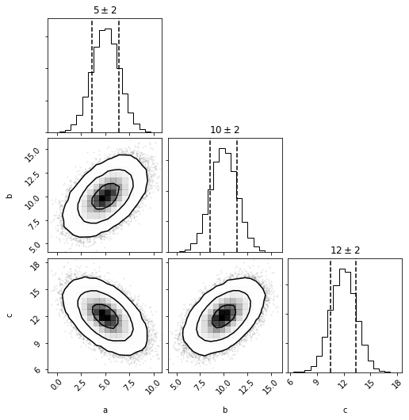
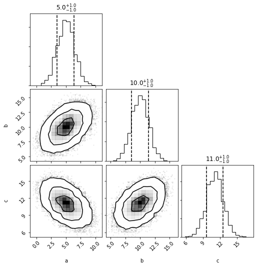

```python
import distl
import numpy as np
```

# Multivariate Gaussian

First we'll create a [multivariate gaussian](../api/MVGaussian.md) distribution by providing the means and covariances of three parameters.


```python
mvg = distl.mvgaussian([5,10, 12], 
                       np.array([[ 2,  1, -1], 
                                 [ 1,  2,  1], 
                                 [-1,  1,  2]]),
                       allow_singular=True,
                       labels=['a', 'b', 'c'])
```


```python
fig = mvg.plot(show=True)
```





```python
mvg_a = mvg.slice('a')
```


```python
mvg_a
```


    <distl.mvgaussianslice dimension=0 mean=[5, 10, 12] cov=[[ 2  1 -1]
     [ 1  2  1]
     [-1  1  2]] allow_singular=True label=a)>


```python
mvg_a.multivariate
```


    <distl.mvgaussian mean=[5, 10, 12] cov=[[ 2  1 -1]
     [ 1  2  1]
     [-1  1  2]] allow_singular=True labels=['a', 'b', 'c']>


```python
mvg_a.dimension
```


    0


```python
mvg_a.label
```


    'a'


The sliced object acts more or less as the univariate version of the multivariate distribution.


```python
mvg_a.loc
```


    5


```python
mvg_a.scale
```


    1.4142135623730951


Sampling draws from the underlying multivariate distribution but only returns the value for the requested dimension.  This means that covariances can be maintained (when using [DistributionCollection](collections.md) or carefully managing the random seeds manually).


```python
mvg_a.sample()
```


    2.8759587467198218


```python
out = mvg_a.plot(show=True)
```


The exposed univariate methods (pdf, cdf, etc) are based on the univariate version (with the exception of ppf, which is disabled).  If you want the probability of drawing a value of 'a', given some values of 'b' and 'c' (for example), then must pass those three values to the underlying multivariate distribution.

**NOTE**: currently there is no ability to plot_pdf of a with fixed values of b and c.... maybe that would be a better use of "slice" and use "flatten" for this current behavior?


```python
out = mvg_a.plot_pdf(show=True)
```


```python
out = mvg_a.multivariate.plot(show=True)
```


```python
g_a = mvg_a.to_univariate()
# same as mvg.to_univariate(dimension='a')
```


```python
g_a
```


    <distl.gaussian loc=5.0 scale=1.4142135623730951 label=a>


```python
out = g_a.plot(show=True)
```


```python
mvh = mvg.to_mvhistogram()
```

# Multivariate Histogram


```python
out = mvh.plot(show=True)
```





```python
mvh_a = mvh.slice('a')
```


```python
mvh_a.sample()
```


    array([3.15930081])


```python
mvh_a.sample(size=3)
```


    array([7.43869597, 3.92138488, 3.74551932])


```python
mvh_a.bins
```


    array([-1.82355657, -0.9442288 , -0.06490102,  0.81442675,  1.69375452,
            2.57308229,  3.45241007,  4.33173784,  5.21106561,  6.09039339,
            6.96972116,  7.84904893,  8.7283767 ,  9.60770448, 10.48703225,
           11.36636002])


```python
mvh_a.density
```


    array([1.73052011e-05, 2.15078927e-04, 1.66253539e-03, 9.93071323e-03,
           4.11925589e-02, 1.16405907e-01, 2.24214837e-01, 2.98087032e-01,
           2.71996970e-01, 1.71515556e-01, 7.39142219e-02, 2.17390408e-02,
           4.51294922e-03, 6.11862466e-04, 6.92208042e-05])


```python
out = mvh_a.plot(show=True, bins=10)
```


```python
out = mvh_a.to_univariate().plot(show=True)
```


