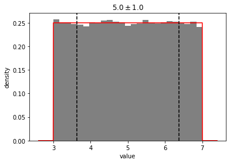
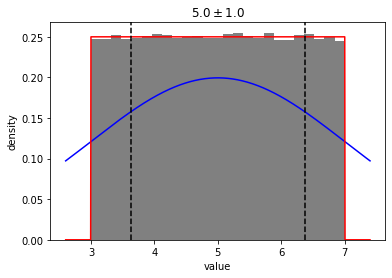

```python
import distl
import numpy as np
```


```python
u = distl.uniform(3, 7)
gh = distl.gaussian(5, 1.5).to_histogram()
```

# plot_sample


```python
out = u.plot_sample(show=True)
```


```python
out = gh.plot_sample(show=True)
```


for more options, see the [plot_sample API docs](../api/BaseDistribution.plot_sample.md).

# plot_pdf


```python
out = u.plot_pdf(show=True)
```


```python
out = gh.plot_pdf(show=True)
```


for more options, see the [plot_pdf API docs](../api/BaseDistribution.plot_pdf.md).

# plot_cdf


```python
out = u.plot_cdf(show=True)
```


```python
out = gh.plot_cdf(show=True)
```


for more options, see the [plot_cdf API docs](../api/BaseDistribution.plot_cdf.md).

# plot_gaussian


```python
out = u.plot_gaussian(show=True)
```


```python
out = gh.plot_gaussian(show=True)
```


for more options, see the [plot_gaussian API docs](../api/BaseDistribution.plot_gaussian.md).

# plot


```python
out = u.plot(show=True)
```





```python
out = u.plot(show=True, plot_gaussian=True)
```





```python
out = u.plot(show=True, plot_gaussian=True, plot_gaussian_kwargs={'sigma': 3})
```


```python
out = gh.plot(show=True)
```


```python
out = gh.plot(200, show=True, plot_gaussian=True)
```


for more options, see the [plot API docs](../api/BaseDistribution.plot.md).
