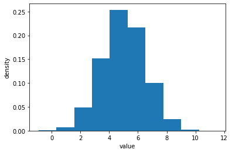
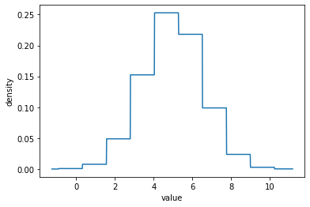
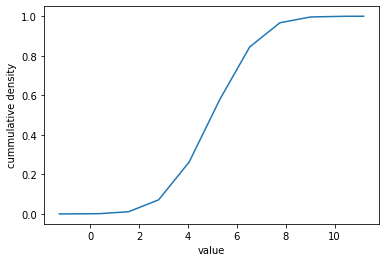
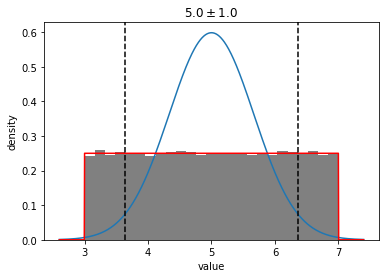
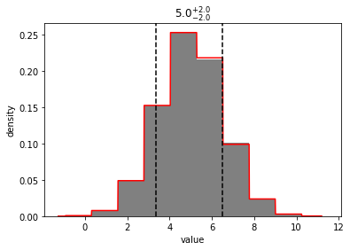
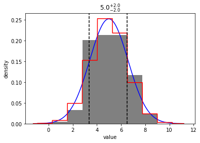

```python
import distl
import numpy as np
```


```python
u = distl.uniform(3, 7)
gh = distl.gaussian(5, 1.5).to_histogram()
```

# plot_sample


```python
out = u.plot_sample(show=True)
```


```python
out = gh.plot_sample(show=True)
```





for more options, see the [plot_sample API docs](../api/BaseDistribution.plot_sample.md).

# plot_pdf


```python
out = u.plot_pdf(show=True)
```


```python
out = gh.plot_pdf(show=True)
```





for more options, see the [plot_pdf API docs](../api/BaseDistribution.plot_pdf.md).

# plot_cdf


```python
out = u.plot_cdf(show=True)
```


```python
out = gh.plot_cdf(show=True)
```





for more options, see the [plot_cdf API docs](../api/BaseDistribution.plot_cdf.md).

# plot_gaussian


```python
out = u.plot_gaussian(show=True)
```


```python
out = gh.plot_gaussian(show=True)
```

    /home/kyle/.local/lib/python3.7/site-packages/scipy/stats/_distn_infrastructure.py:1675: IntegrationWarning: The maximum number of subdivisions (50) has been achieved.
      If increasing the limit yields no improvement it is advised to analyze 
      the integrand in order to determine the difficulties.  If the position of a 
      local difficulty can be determined (singularity, discontinuity) one will 
      probably gain from splitting up the interval and calling the integrator 
      on the subranges.  Perhaps a special-purpose integrator should be used.
      return integrate.quad(self._mom_integ1, 0, 1, args=(m,)+args)[0]


for more options, see the [plot_gaussian API docs](../api/BaseDistribution.plot_gaussian.md).

# plot


```python
out = u.plot(show=True)
```


```python
out = u.plot(show=True, plot_gaussian=True)
```


```python
out = u.plot(show=True, plot_gaussian=True, plot_gaussian_kwargs={'sigma': 3})
```





```python
out = gh.plot(show=True)
```





```python
out = gh.plot(200, show=True, plot_gaussian=True)
```





for more options, see the [plot API docs](../api/BaseDistribution.plot.md).
