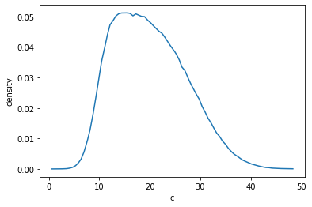
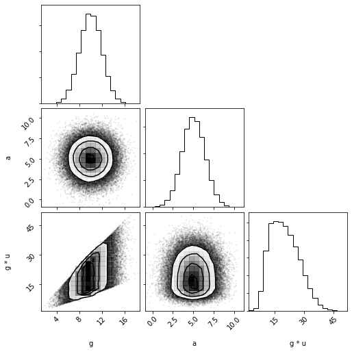

```python
import distl
import numpy as np
```

Unless `cache_sample=False` is passed, calling `sample` will cache the results so that successive calls to `pdf`, `logpdf`, `cdf`, `logcdf`, etc are computed based on the latest sampled values.  This avoids the need to do the following:

```
samples = dist.sample()
print(samples)
dist.pdf(samples)
```

Although this wouldn't exactly be difficult for a simple univariate and even multivariate cases... things get a lot more complicated with MultivariateSlice, Composite, and DistributionCollections.  `distl` allows for tracking the samples of the underlying distributions, but it is important to understand when covariances are respected and when they're ignored.

# Univariate Distributions


```python
g = distl.gaussian(10, 2, label='g')
```


```python
g.sample()
```


    10.167188986169707


```python
g.cached_sample
```


    10.167188986169707


```python
g.pdf()
```


    0.19877540029208976


If passing `size` to `sample` then the cached values will keep that shape and `pdf` etc will return an array with one entry per sample.


```python
g.sample(size=2)
```


    array([10.60260995,  5.71212654])


```python
g.cached_sample
```


    array([10.60260995,  5.71212654])


```python
g.pdf()
```


    array([0.1906191 , 0.02003413])


Of course at any point a value can be passed to any of this methods to override computing at the cached sample values.


```python
g.pdf(10.5)
```


    0.19333405840142465


# Multivariate Distributions

Multivariate distributions essentially act the same as Univariate distributions except the returned samples have an extra dimension.  The provided covariances are always respected - calls to `pdf` etc return the probability of drawing the provided *set* of values from the multivariate distribution.


```python
mvg = distl.mvgaussian([5,10, 12], 
                       np.array([[ 2,  1, -1], 
                                 [ 1,  2,  1], 
                                 [-1,  1,  2]]),
                       allow_singular=True,
                       labels=['a', 'b', 'c'])
```


```python
mvg.sample()
```


    array([ 7.02964716, 10.92688488, 10.89723771])


```python
mvg.cached_sample.shape[-1], mvg.ndimensions
```


    (3, 3)


For multivariates, `pdf` is the probability density of drawing the set of values for each dimension.


```python
mvg.pdf()
```


    0.018893563051968935


If passing `size` to `sample`, then the samples will be of shape (`size`, `ndimensions`) and the `pdf` call will return an array with length `size`.


```python
mvg.sample(size=2)
```


    array([[ 3.68478224, 10.068247  , 13.38346476],
           [ 1.25683317,  7.92986557, 13.6730324 ]])


```python
mvg.cached_sample
```


    array([[ 3.68478224, 10.068247  , 13.38346476],
           [ 1.25683317,  7.92986557, 13.6730324 ]])


```python
mvg.pdf()
```


    array([0.0288813 , 0.00157665])


# MultivariateSlice Distributions

It is important to remember that MultivariateSlices act as Univariate distributions for all cases except sampling - in which case the covariances can be remembered.  This allows for a lot of convenience functionality such as plotting the projected pdf.  That said - since the underlying distribution is a multivariate, the multivariate probabilities can still be manually accessed.


```python
mvg_a = mvg.slice('a')
```


```python
mvg_a.sample()
```


    4.8539220309842825


```python
mvg_a.cached_sample
```


    4.8539220309842825


```python
mvg_a.multivariate.cached_sample
```


    array([ 4.85392203, 12.30512786, 14.45120583])


A call to `pdf` will expose the `pdf` of the flattened univariate representation of this slice given `cached_sample` above.


```python
mvg_a.pdf()
```


    0.28059390952277485


Note the important distinction between the line above and the one below.  Below we are accessing the probability of drawing the set of drawn values (from `mvg_a.multivariate.cached_sample`).


```python
mvg_a.multivariate.pdf()
```


    0.008010117140377679


As in the other cases, this same logic applies when passing `size` to `sample`.


```python
mvg_a.sample(size=2)
```


    array([4.80077553, 2.67374927])


```python
mvg_a.cached_sample
```


    array([ 4.80077553, 10.23287694, 12.43210141])


```python
mvg_a.pdf()
```


    array([2.79309520e-01, 3.00139736e-04, 2.83928049e-07])


# Composite Distributions

Similarly to MultivariateSlices, Composite distributions also expose the univariate pdfs after any math operations, but use the underlying "children" distributions when sampling to respect any covariances.


```python
g = distl.gaussian(10, 2, label='g')
u = distl.uniform(1, 3, label='u')
c = g * u
```


```python
c.sample()
```


    15.8762525620385


```python
c.cached_sample
```


    15.8762525620385


As with MultivariateSlices, `pdf` here is exposing the probability of drawing `cached_sample` (or the provided value) from the combined/flattened distribution.


```python
c.pdf()
```


    0.051073209841133484


where the pdf is being determined from the stored (interpolated) flattened pdf function.


```python
out = c.plot_pdf(show=True)
```





However, the underlying drawn values of the children distributions are still accessible.  Here we can see the values for the gaussian and uniform distributions that were drawn before applying multiplication.


```python
c.cached_sample_children
```


    array([10.94214357,  1.45092709])


```python
c.cached_sample_children[0] * c.cached_sample_children[1]
```


    15.8762525620385


If we wanted to, we could determine the individual probabilities of drawing these two components.


```python
c.dist1.pdf(c.cached_sample_children[0]), c.dist2.pdf(c.cached_sample_children[1])
```


    (0.17852260843613382, 0.5)


The probability of drawing this *set* of values from the children would then be the product (or the sum in the case of `logpdf`).


```python
c.dist1.pdf(c.cached_sample_children[0]) * c.dist2.pdf(c.cached_sample_children[1])
```


    0.08926130421806691


As you probably expect by now, the same logic holds when passing `size` to `sample`.


```python
c.sample(size=2)
```


    array([15.87625256, 21.62435506])


```python
c.cached_sample
```


    array([15.87625256, 21.62435506])


```python
c.cached_sample_children
```


    array([[10.94214357,  8.93556764],
           [ 1.45092709,  2.42003149]])


# Distribution Collection


```python
dc = distl.DistributionCollection(g, mvg_a, c)
```


```python
dc
```


    <distl.distl.DistributionCollection at 0x7fd3d9ad2d10>


```python
dc.sample()
```


    array([12.51637475,  4.51864764, 23.29024698])


For collections, `cached_sample` refers to the passed `distributions`...


```python
dc.cached_sample
```


    array([12.51637475,  4.51864764, 23.29024698])


```python
dc.labels
```


    ['g', 'a', 'g * u']


... whereas `cached_samples_unpacked` refers to the unpacked list of all underlying distributions (i.e. composite distributions are broken down into their subcomponents so that all the actual drawn values can be recorded to track covariances).


```python
dc.cached_sample_unpacked
```


    array([12.51637475,  4.51864764, 12.51637475,  1.86078217])


```python
dc.labels_unpacked
```


    ['g', 'a', 'g', 'u']


We can notice a few things here.  The first is that `u` shows up twice (as it is returned in the sample but also used in the math to compute `c`), and is given the same value in both cases.  Furthermore, `c` was defined as `g * u`, which we can confirm here by doing math on the cached values.


```python
dc.cached_sample_unpacked[2] * dc.cached_sample_unpacked[3], dc.cached_sample[2]
```


    (23.290246982803612, 23.290246982803612)


We can also see that the covariances are respected by plotting.  For more details, see the [DistributionCollections examples](./collections.md).


```python
out = dc.plot(show=True)
```





Now if we rely on the cached values when calling [pdf](../api/DistributionCollection.pdf.md) it will default to passing [cached_sample_unpacked](../api/DistributionCollection.cached_sample_unpacked.md) (and ignoring duplicate entries when doing the sum/product), therefore accounting for covariances.


```python
dc.cached_sample
```


    array([12.51637475,  4.51864764, 23.29024698])


```python
dc.cached_sample_unpacked
```


    array([12.51637475,  4.51864764, 12.51637475,  1.86078217])


```python
dc.pdf()
```


    0.01203197277753596


To avoid this behavior and instead treat each of the three sampled values in their univariate forms, you can pass `as_univariates=True`.

**NOTE**: if you're passing values manually to `pdf`, the length of the passed array must agree with `as_univariates`.  In some cases (like this one) the lengths are different and so an error will be raised if they're in disagreement.  But in other cases the lengths can be the same, and so the behavior will rely on the value of `as_univariates` which defaults to `False`.  See [collections examples](./collections.md) for more details and a more in-depth discussion on the behavior or `as_univariates`.


```python
dc.pdf(as_univariates=True)
```


    0.0010213576374601481


