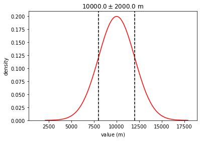
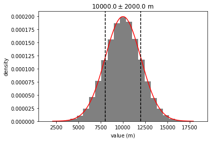

```python
import distl
import astropy.units as u
```

# Create Distribution With Units

Units can be attached to a distribution either by passing `unit` to the creation function, or multiplying a Distribution object by a unit object.


```python
g = distl.gaussian(10, 2, unit=u.km)
```


```python
g = distl.gaussian(10, 2) * u.km
```


```python
g
```


    <distl.gaussian loc=10.0 scale=2.0 unit=km>


```python
out = g.plot(show=True)
```


# Sample/Plot in Different Units


```python
g.sample(unit=u.m)
```


    8333.442785173229


```python
out = g.plot(unit=u.m, show=True)
```





# Translate Units


```python
g_meters = g.to(u.m)
```


```python
g_meters
```


    <distl.gaussian loc=10000.0 scale=2000.0 unit=m>


```python
out = g_meters.plot(show=True)
```





```python

```
