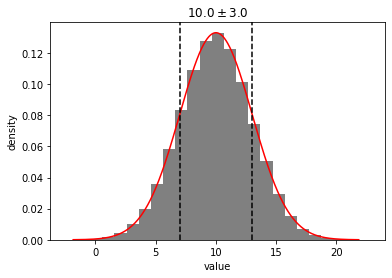
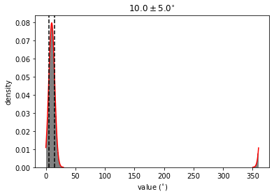

```python
import distl
import astropy.units as u
```

# Example 1: Gaussian with Custom `wrap_at`

Let's create a [Gaussian distribution](../api/Gaussian.md) centered around 10, and tell `distl` to wrap the distribution at 12.  Whenever we call sample, values that extend beyone 10 will be wrapped onto the range `[0-10]`.


```python
g = distl.gaussian(10, 2, wrap_at=12)
out = g.plot(show=True)
```


To _temporarily_ disable wrapping, just pass `wrap_at=False` to [sample](../api/Gaussian.sample.md) or [plot](../api/Gaussian.plot.md).


```python
out = g.plot(show=True, wrap_at=False)
```





To _temporarily_ use a different value for wrapping, pass that value to `wrap` in [sample](../api/Gaussian.sample.md) or [plot](../api/Gaussian.plot.md)


```python
out = g.plot(show=True, wrap_at=14)
```


If we convert this [Gaussian distribution](../api/Gaussian.md) to a [Histogram](../api/Histogram.md), the wrapping will be maintained.  But note that the underlying distribution bins will be unwrapped, meaning that we can still fit a guassian pre-wrapping.


```python
gh = g.to_histogram()
out = gh.plot(show=True, plot_gaussian=True)
```

    /home/kyle/.local/lib/python3.7/site-packages/scipy/stats/_distn_infrastructure.py:1675: IntegrationWarning: The maximum number of subdivisions (50) has been achieved.
      If increasing the limit yields no improvement it is advised to analyze 
      the integrand in order to determine the difficulties.  If the position of a 
      local difficulty can be determined (singularity, discontinuity) one will 
      probably gain from splitting up the interval and calling the integrator 
      on the subranges.  Perhaps a special-purpose integrator should be used.
      return integrate.quad(self._mom_integ1, 0, 1, args=(m,)+args)[0]


# Example 2: Automatic Wrapping for Distributions with Angle Units


```python
i = distl.gaussian(10, 5)*u.deg
out = i.plot(show=True, bins=200)
```





```python
out = i.plot(show=True, wrap_at=False, bins=200)
```


```python
out = i.plot(show=True, bins=200, wrap_at=False, unit=u.rad)
# TODO: need to fix plot_pdf renormalization for changing units
```


```python
p = distl.gaussian(0.9, 0.2)*u.cycle
out = p.plot(show=True, bins=20)
```


# Example 3: Uniform Distribution with `low` > `high`


```python
b = distl.uniform(340, 20)*u.deg
out = b.plot(show=True, bins=200)
# TODO: this seems to be broken by the rewrite
```

    /home/kyle/.local/lib/python3.7/site-packages/matplotlib/axes/_axes.py:6735: RuntimeWarning: All-NaN slice encountered
      xmin = min(xmin, np.nanmin(xi))
    /home/kyle/.local/lib/python3.7/site-packages/matplotlib/axes/_axes.py:6736: RuntimeWarning: All-NaN slice encountered
      xmax = max(xmax, np.nanmax(xi))


    ---------------------------------------------------------------------------

    ValueError                                Traceback (most recent call last)

    <ipython-input-10-126eaa1bb839> in <module>
          1 b = distl.uniform(340, 20)*u.deg
    ----> 2 out = b.plot(show=True, bins=200)
          3 # TODO: this seems to be broken by the rewrite


    ~/.local/lib/python3.7/site-packages/distl-0.1.0.dev0-py3.7.egg/distl/distl.py in plot(self, size, unit, wrap_at, seed, samples, plot_sample, plot_sample_kwargs, plot_pdf, plot_pdf_kwargs, plot_cdf, plot_cdf_kwargs, plot_gaussian, plot_gaussian_kwargs, label, xlabel, show, **kwargs)
        832             for k,v in kwargs.items():
        833                 plot_sample_kwargs.setdefault(k,v)
    --> 834             ret_sample = self.plot_sample(size=int(size), samples=samples, unit=unit, wrap_at=wrap_at, seed=seed, show=False, **plot_sample_kwargs)
        835         else:
        836             ret_sample = None


    ~/.local/lib/python3.7/site-packages/distl-0.1.0.dev0-py3.7.egg/distl/distl.py in plot_sample(self, size, unit, wrap_at, seed, samples, label, xlabel, show, **kwargs)
        965 
        966         try:
    --> 967             ret = _plt.hist(samples, density=True, **kwargs)
        968         except AttributeError:
        969             # TODO: determine which version of matplotlib


    ~/.local/lib/python3.7/site-packages/matplotlib/pyplot.py in hist(x, bins, range, density, weights, cumulative, bottom, histtype, align, orientation, rwidth, log, color, label, stacked, normed, data, **kwargs)
       2640         align=align, orientation=orientation, rwidth=rwidth, log=log,
       2641         color=color, label=label, stacked=stacked, normed=normed,
    -> 2642         **({"data": data} if data is not None else {}), **kwargs)
       2643 
       2644 


    ~/.local/lib/python3.7/site-packages/matplotlib/__init__.py in inner(ax, data, *args, **kwargs)
       1599     def inner(ax, *args, data=None, **kwargs):
       1600         if data is None:
    -> 1601             return func(ax, *map(sanitize_sequence, args), **kwargs)
       1602 
       1603         bound = new_sig.bind(ax, *args, **kwargs)


    ~/.local/lib/python3.7/site-packages/matplotlib/axes/_axes.py in hist(self, x, bins, range, density, weights, cumulative, bottom, histtype, align, orientation, rwidth, log, color, label, stacked, normed, **kwargs)
       6765             # this will automatically overwrite bins,
       6766             # so that each histogram uses the same bins
    -> 6767             m, bins = np.histogram(x[i], bins, weights=w[i], **hist_kwargs)
       6768             m = m.astype(float)  # causes problems later if it's an int
       6769             if mlast is None:


    <__array_function__ internals> in histogram(*args, **kwargs)


    ~/.local/lib/python3.7/site-packages/numpy/lib/histograms.py in histogram(a, bins, range, normed, weights, density)
        793     a, weights = _ravel_and_check_weights(a, weights)
        794 
    --> 795     bin_edges, uniform_bins = _get_bin_edges(a, bins, range, weights)
        796 
        797     # Histogram is an integer or a float array depending on the weights.


    ~/.local/lib/python3.7/site-packages/numpy/lib/histograms.py in _get_bin_edges(a, bins, range, weights)
        427             raise ValueError('`bins` must be positive, when an integer')
        428 
    --> 429         first_edge, last_edge = _get_outer_edges(a, range)
        430 
        431     elif np.ndim(bins) == 1:


    ~/.local/lib/python3.7/site-packages/numpy/lib/histograms.py in _get_outer_edges(a, range)
        325         if not (np.isfinite(first_edge) and np.isfinite(last_edge)):
        326             raise ValueError(
    --> 327                 "autodetected range of [{}, {}] is not finite".format(first_edge, last_edge))
        328 
        329     # expand empty range to avoid divide by zero


    ValueError: autodetected range of [nan, nan] is not finite


Note that passing `wrap_at` to [sample](../api/Uniform.sample.md) or [plot](../api/Uniform.plot.md) will only affect the wrapping _after_ sampling.  To change the "unwrapping" of the `low` and `high` bounds of the boxcar, you must change the attributes themselves.  For example:


```python
print(b.low, b.high)
```


```python
print(b.get_wrap_at())
```


```python
out = b.plot(show=True, wrap_at=False)
```


```python

```
