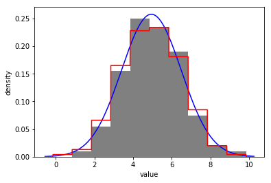
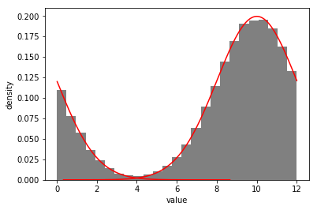
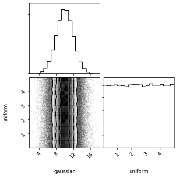

<p align="center"><a href="http://dist.readthedocs.io"></a></p>

<p align="center" style="text-align:center"><i>simplified and condensed distributions</i></p>

<!-- <pre align="center" style="text-align:center; font-family:monospace; margin: 30px">
  pip install distl
</pre> -->

[](https://github.com/kecnry/distl)
[](https://pypi.org/project/distl/)

[](https://github.com/kecnry/distl/blob/master/LICENSE)
[](https://travis-ci.com/kecnry/distl)
[](https://codecov.io/gh/kecnry/distl)
[](https://distl.readthedocs.io/en/latest/?badge=latest)


**IMPORTANT**: **distl** is currently still under development, is not yet well-tested, and is subject to significant API changes.  Please check back until an official release is ready.

**distl** provides a python object-interface on top of several distribution (random variable) functions in [scipy.stats](https://docs.scipy.org/doc/scipy/reference/stats.html) and allows for:

  - serialization of distributions (so they can be saved to disk or pickled and sent to processors within MPI)
  - support for units and wrapping
  - conversion between different types of distributions
  - math between distributions, handling covariances from multivariate distributions wherever possible
  - plotting convenience functions


## Getting Started

### Dependencies

**distl** requires the following dependencies:

  - python 2.7+ or 3.6+
  - scipy 1.0+
  - numpy 1.10+


and the following optional dependencies:

  - matplotlib 2.2+ (required for plotting distributions)
  - [corner](https://corner.readthedocs.io) (required for plotting multivariate distributions and distribution collections)
  - astropy 1.0+ (required for units support)
  - dill (required for saving/loading [Function](./api/Function.md) distributions)


You can see the [Travis testing matrix](https://travis-ci.com/kecnry/distl) for
details on what exact versions have been tested and ensured to work.  If you run
into any issues with dependencies, please [submit an issue](https://github.com/kecnry/distl/issues/new).

### Installation

To install locally for a single user:

```sh
python setup.py build
python setup.py install --user
```

Or to install globally:

```sh
python setup.py build
sudo python setup.py install
```

### Import

Now from within python we can import the `distl` package:

```py
import distl
```

and then create, sample from, and plot our first distribution:

```py
g = distl.gaussian(10, 1)
print(g.sample())
print(g.sample(10))
g.plot(show=True)
```

## Supported Distribution Types

Creation functions for the following distribution types are currently implemented
and available at the [top-level of distl](./api/distl.md):

* [delta](./api/distl.delta.md)
* [gaussian](./api/distl.gaussian.md)
* [normal](./api/distl.normal.md) (shortcut to gaussian)
* [uniform](./api/distl.uniform.md)
* [boxcar](./api/distl.boxcar.md) (shortcut to uniform)
* [histogram_from_data](./api/distl.histogram_from_data.md) or [histogram_from_bins](./api/distl.histogram_from_bins.md)
* [samples](./api/dist.samples.md)
* [mvgaussian](./api/distl.mvgaussian.md)
* [mvhistogram_from_data](./api/distl.mvhistogram_from_data.md)
* [mvsamples](./api/distl.mvsamples.md)
* [function](./api/distl.function.md)

## Converting Between Distribution Types

Distributions within distl allow for converting to other distribution types.
See the [API documention](./api/) for the appropriate distribution type
and look for the `to_` methods to convert along with a description of the options
and limitations.  Below is a summary of all implemented translation methods:

* [Delta](./api/Delta.md)
    * [to_gaussian](./api/Delta.to_gaussian.md)
    * [to_histogram](./api/Delta.to_histogram.md)
    * [to_samples](./api/Delta.to_samples.md)
    * [to_uniform](./api/Delta.to_uniform.md)
* [Gaussian](./api/Gaussian.md)
    * [to_delta](./api/Gaussian.to_delta.md)
    * [to_histogram](./api/Gaussian.to_histogram.md)
    * [to_samples](./api/Gaussian.to_samples.md)
    * [to_uniform](./api/Gaussian.to_uniform.md)
* [Uniform](./api/Uniform.md)
    * [to_delta](./api/Uniform.to_delta.md)
    * [to_gaussian](./api/Uniform.to_gaussian.md)
    * [to_histogram](./api/Uniform.to_histogram.md)
    * [to_samples](./api/Uniform.to_samples.md)
* [Composite](./api/Composite.md)
    * [to_gaussian](./api/Composite.to_gaussian.md) (via histogram)
    * [to_histogram](./api/Composite.to_histogram.md)
    * [to_uniform](./api/Composite.to_uniform.md) (via histogram)
    * [to_samples](./api/Composite.to_samples.md)
* [Histogram](./api/Histogram.md)
    * [to_delta](./api/Histogram.to_delta.md)
    * [to_gaussian](./api/Histogram.to_gaussian.md)
    * [to_uniform](./api/Histogram.to_uniform.md) (via to_gaussian)
    * [to_samples](./api/Histogram.to_samples.md)
* [Samples](./api/Samples.md)
    * [to_delta](./api/Samples.to_delta.md)
    * [to_gaussian](./api/Samples.to_gaussian.md)
    * [to_histogram](./api/Samples.to_histogram.md)
    * [to_uniform](./api/Samples.to_uniform.md) (via to_gaussian)
* [Function](./api/Function.md)
    * [to_gaussian](./api/Function.to_gaussian.md) (via histogram)
    * [to_histogram](./api/Function.to_histogram.md)
    * [to_uniform](./api/Function.to_uniform.md) (via histogram)
    * [to_samples](./api/Function.to_samples.md)
* [MVGaussian](./api/MVGaussian.md)
    * [slice](./api/MVGaussian.slice.md) (to convert to [MVGaussianSlice](./api/MVGaussianSlice.md))
    * [take_dimensions](./api/MVGaussian.take_dimensions.md) (returns another [MVGaussian](./api/MVGaussian.md))
    * [to_univariate](./api/MVGaussian.to_univariate.md) (shortcut to to_gaussian)
    * [to_mvhistogram](./api/MVGaussian.to_mvhistogram.md)
    * [to_gaussian](./api/MVGaussian.to_gaussian.md)
    * [to_histogram](./api/MVGaussian.to_histogram.md) (via to_gaussian)
* [MVGaussianSlice](./api/MVGaussianSlice.md)
    * [to_univariate](./api/MVGaussianSlice.to_univariate.md) (shortcut to to_gaussian)
    * [to_delta](./api/MVGaussianSlice.to_delta.md)
    * [to_gaussian](./api/MVGaussianSlice.to_gaussian.md)
    * [to_histogram](./api/MVGaussianSlice.to_histogram.md) (via to_gaussian)
* [MVHistogram](./api/MVHistogram.md)
    * [slice](./api/MVHistogram.slice.md) (to convert to [MVHistogramSlice](./api/MVHistogramSlice.md))
    * [take_dimensions](./api/MVHistogram.take_dimensions.md) (returns another [MVHistogram](./api/MVHistogram.md))
    * [to_univariate](./api/MVHistogram.to_univariate.md) (shortcut to to_histogram)
    * [to_mvgaussian](./api/MVHistogram.to_mvgaussian.md)
    * [to_gaussian](./api/MVHistogram.to_gaussian.md) (via to_histogram)
    * [to_histogram](./api/MVHistogram.to_histogram.md)
* [MVHistogramSlice](./api/MVHistogramSlice.md)
    * [to_univariate](./api/MVHistogramSlice.to_univariate.md) (shortcut to to_histogram)
    * [to_delta](./api/MVHistogramSlice.to_delta.md)
    * [to_gaussian](./api/MVHistogramSlice.to_gaussian.md) (via to_histogram)
    * [to_histogram](./api/MVHistogramSlice.to_histogram.md)
* [MVSamples](./api/MVSamples.md)
    * [slice](./api/MVSamples.slice.md) (to convert to [MVSamplesSlice](./api/MVSamplesSlice.md))
    * [take_dimensions](./api/MVSamples.take_dimensions.md) (returns another [MVSamples](./api/MVSamples.md))
    * [to_univariate](./api/MVSamples.to_univariate.md) (shortcut to to_samples)
    * [to_mvgaussian](./api/MVSamples.to_mvgaussian.md)
    * [to_gaussian](./api/MVSamples.to_gaussian.md) (via to_histogram)
    * [to_histogram](./api/MVSamples.to_histogram.md)
    * [to_samples](./api/MVSamples.to_samples.md)

## Sampling

To sample from any distribution, call the [sample](./api/BaseDistribution.sample.md) method,
optionally passing the number of desired samples.

```python
g = distl.gaussian(10, 2)
g.sample(10)
```

    array([ 8.07893271, 12.51150027,  7.56756268,  7.29151051,  5.55049747,
            8.67495845, 11.61104165, 10.11544651, 11.96864228, 10.54677169])


See [these sampling examples](./examples/sampling.md) for more details.

To ensure consistent results (when needed), pass `seed` to [sample](./api/BaseDistribution.sample)
or set the random seed in numpy prior to sampling.

```python
g = distl.gaussian(10, 2)
g.sample(seed=1234)
g.sample(seed=1234)
np.random.seed(1234)
g.sample()
```

See [this seeding example](./examples/random_seed.md) for more details.

## Plotting

**NOTE:** matplotlib is required for plotting support.

To plot the distribution, call one of the following:

* [plot](./api/BaseDistribution.plot.md)
* [plot_pdf](./api/BaseDistribution.plot_pdf.md)
* [plot_cdf](./api/BaseDistribution.plot_cdf.md)
* [plot_sample](./api/BaseDistribution.plot_sample.md)
* [plot_gaussian](./api/BaseDistribution.plot_gaussian.md)

```py
gh = distl.gaussian(5, 3).to_histogram()
out = gh.plot(200, show=True, plot_gaussian=True)
```



See [these plotting examples](./examples/plotting.md) for more details.

## Serializing

```py
g = distl.gaussian(5, 3)
g = distl.from_dict(g.to_dict())
```

See the API docs on the following for more details:

  - [to_dict](./api/BaseDistribution.to_dict.md)
  - [from_dict](./api/distl.from_dict.md)
  - [to_json](./api/BaseDistribution.to_json.md)
  - [from_json](./api/distl.from_json.md)
  - [to_file](./api/BaseDistribution.to_file.md)
  - [from_file](./api/distl.from_file.md)


## Math with Distribution Objects

Any (supported) math operator between two Distribution objects, or between a Distribution object and a float or integer, will return another Distribution object.  In most cases, this will return a [Composite Distribution](./api/Composite.md).  In some cases where it is possible to return the same type of Distribution, that will be done instead.  For example, a [Gaussian Distribution](./api/Gaussian.md) multiplied by a float can return another [Gaussian Distribution](./api/Gaussian.md) where that float is interpreted as a [Delta Distribution](./api/Delta.md) with that value.

This means that in the following case `2 * g` is equivalent to `d * g`, but **not** `g + g`:

```py
g = distl.gaussian(10, 2)
d = distl.delta(2)
```

Currently supported operators include:

* multiplication, division, addition, subtraction
* np.sin, np.cos, np.tan (but not math.sin, etc)

See [these math examples](./examples/math.md) for more details.


## Support for Units

**NOTE:** astropy is required for units support.

Units can be set for a distribution by setting the [unit](./api/BaseDistribution.unit.md), by passing `unit` to the constructor, or by multiplying the distribution object by an astropy.unit object.

To change units, you can then call [to](./api/BaseDistribution.to.md) to return a new distribution in the requested units.

See [these units examples](./examples/units.md) for more details.

## Wrapping

```py
g = distl.gaussian(10, 2, wrap_at=12)
out = g.plot(show=True)
```


See [these wrapping examples](./examples/wrapping.md) for more details.

## Slicing Multivariate Distributions

```py
mvg = distl.mvgaussian([5,10, 12],
                       np.array([[ 2,  1, -1],
                                 [ 1,  2,  1],
                                 [-1,  1,  2]]),
                       allow_singular=True,
                       labels=['mvg_a', 'mvg_b', 'mvg_c'])
mvg_a = mvg.slice('a')
mvg_a.sample()
mvg_a.plot(show=True)
```

See [these slicing examples](./examples/multivariate_slice.md) for more details.


## Drawing and Computing Probabilities for Multiple Distributions via DistributionCollections

```py
g = distl.gaussian(10, 2, label='gaussian')
u = distl.uniform(0, 5, label='uniform')
dc = distl.DistributionCollection(g, u)
dc.plot(show=True)
```



See [these collections examples](./examples/collections.md) for more details.


## API Documentation

See the [API documentation](./api.md) for full details on each type of available distribution.

## Contributors

[Kyle Conroy](https://github.com/kecnry)

Contributions are welcome!  Feel free to file an issue or fork and create a pull-request.
